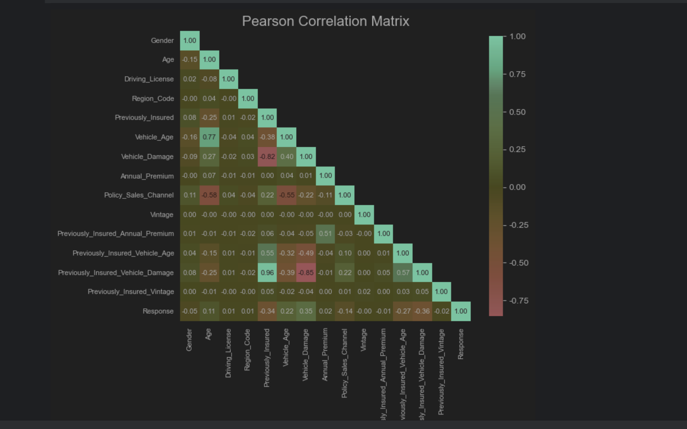
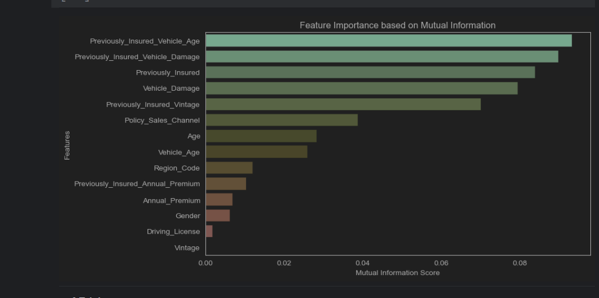
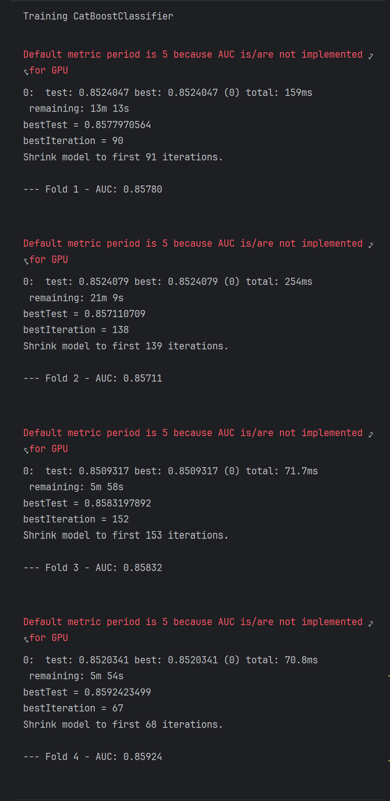
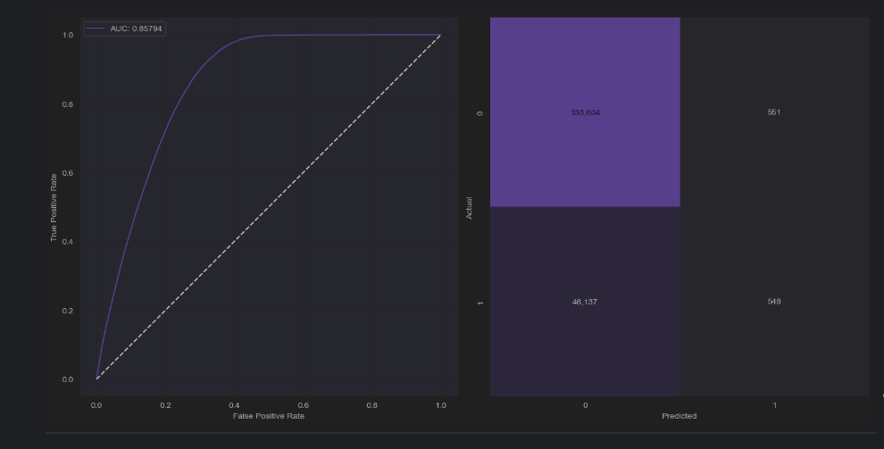
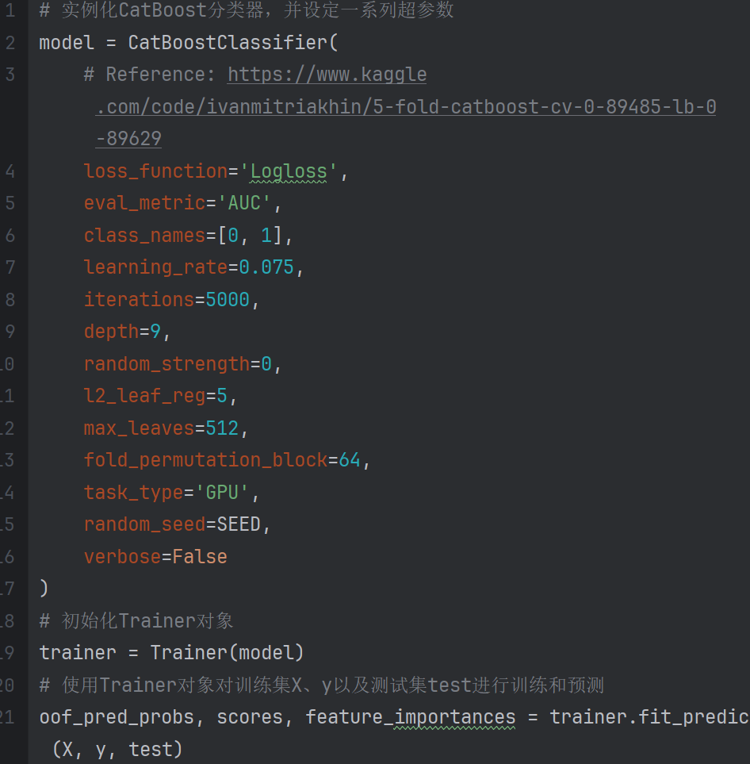
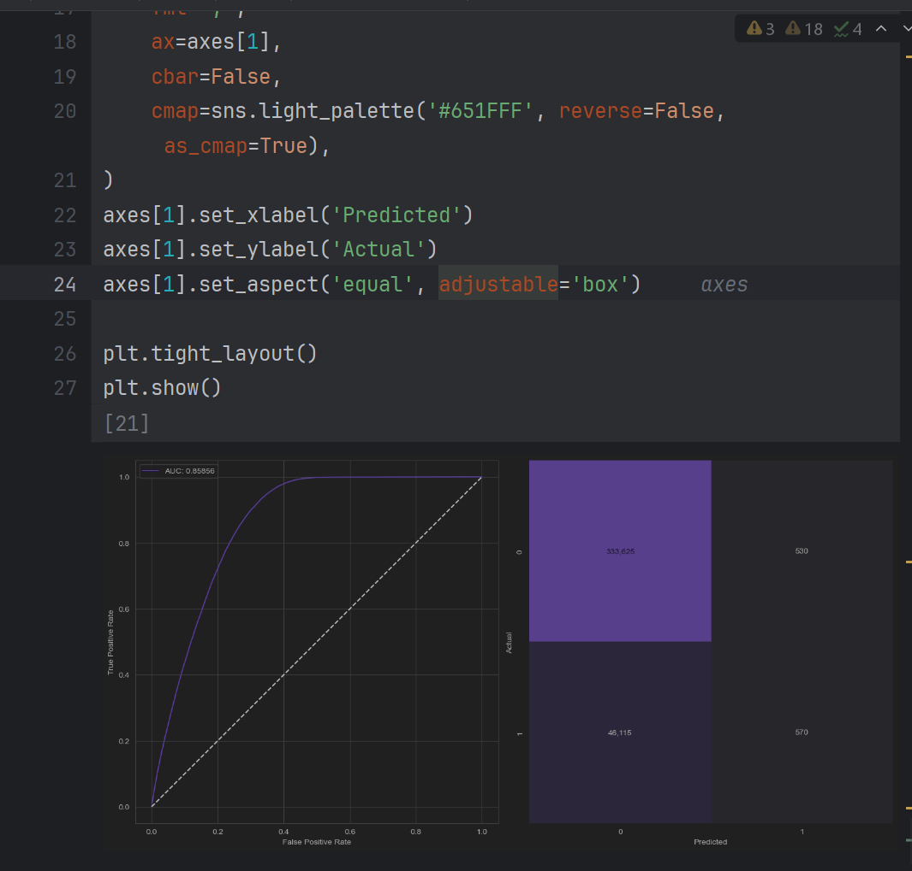

整体流程

```
# 导入所需的库
# 设置全局变量
TARGET = 'Response'
TARGET = 'Response'  # 目标变量名
N_FOLDS = 5  # K折交叉验证的折数
SEED = 90  # 随机种子
ES_ROUNDS = 150  # 提前停止轮数
ES_LOG_STEPS = 500  # 日志记录步长
TRAIN_PATH = 'E:/Pycharm_5/test1/train.csv'  # 训练集路径
TEST_PATH = 'E:/Pycharm_5/test1/test.csv'  # 测试集路径
ORIGINAL_PATH = 'E:/Pycharm_5/test1/train.csv'  # 原始数据路径
数据加载与预处理类……
对类别特征进行编码……
转换数据类型以节省内存……
# 加载数据
train, test = DataLoader(TRAIN_PATH, TEST_PATH).load()
# 分离特征和目标变量
X = train.drop(columns=TARGET)
y = train[TARGET]
# 获取所有特征列加上目标变量列的列表
cols = list(X.columns) + [TARGET]  
```

```
# Trainer类定义了一个训练器对象，可以用来执行K折交叉验证、模型训练以及预测。
```

```
# 实例化CatBoost分类器，并设定一系列超参数
model = CatBoostClassifier(
    # Reference: https://www.kaggle.com/code/ivanmitriakhin/5-fold-catboost-cv-0-89485-lb-0-89629
    loss_function='Logloss',
    eval_metric='AUC',
    class_names=[0, 1],
    learning_rate=0.075,
    iterations=5000,
    depth=9,
    random_strength=0,
    l2_leaf_reg=0.5,
    max_leaves=512,
    fold_permutation_block=64,
    task_type='GPU',
    random_seed=SEED,
    verbose=False
)
# 初始化Trainer对象
# 使用Trainer对象对训练集X、y以及测试集test进行训练和预测
```


第一次AUC为0.85794，尝试优化，调整L2正则化强度以防止过拟合，从0.5调到5，auc指数至0.85828


第二次AUC为0.85828,；想再次优化：调整交叉验证策略，把折数n_folds5=10此时AUC为：0.8585


